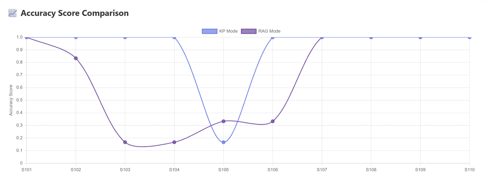
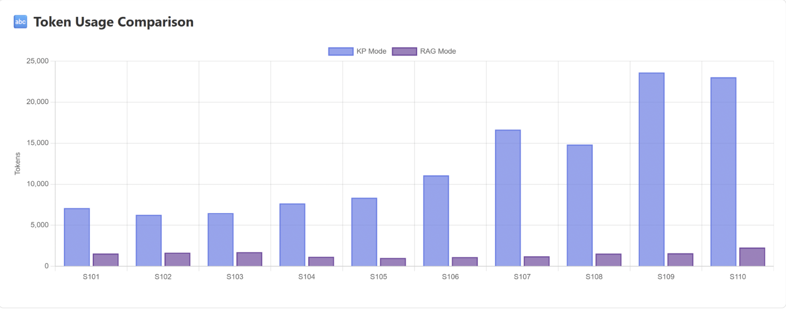

# HPML Final Project: AssetOpsBench MCP Skills Server

> **Course:** High Performance Machine Learning
> **Semester:** Spring 2026
> **Instructor:** Dr. Kaoutar El Maghraoui

---

## Team Information

- **Team Name:** Team 3
- **Members:**
  - Yeshitha Bhuvanesh (yb2649) — *Baseline RAG, Knowledge Plugin*
  - Andrew Li (ayl2159) — *Benchmarking, dashboard visualizations, bug fixes*
  - Trisha Maturi (tm3530) — *Skills MCP server architecture*
  - Kirthana Natarajan (kmn2161) — *Observability infra, Baseline, Skills MCP Server*
  - Thai On (tqo2101) — *Benchmarking and commands, dashboard refinements*

## Submission

- **GitHub repository:** [https://github.com/kmn01/AssetOpsBench/](https://github.com/kmn01/AssetOpsBench/)
- **Final report:** [`deliverables/HPML_Final_Report.pdf`](deliverables/HPML_Final_Report.pdf)
- **Final presentation:** [`deliverables/HPML_Final_Presentation.pptx`](deliverables/HPML_Final_Presentation.pptx)
- **Experiment-tracking dashboard:** [https://wandb.ai/kmn01-columbia-university/HPML%20Project/](https://wandb.ai/kmn01-columbia-university/HPML%20Project/)

The final report PDF and the presentation file are checked into the `deliverables/` folder of this repository **and** uploaded to CourseWorks.

---

## 1. Problem Statement

This project extends AssetOpsBench, a framework for developing, orchestrating, and evaluating AI agents for industrial asset operations and maintenance. We focus on two inference-time workstreams: improving multi-tool orchestration through an MCP Skills Server, and benchmarking a domain-specific Knowledge Plugin against traditional ChromaDB/RAG-style retrieval.

The system being optimized is an agentic inference pipeline where an LLM must discover available MCP tools, plan a workflow, call tools, retrieve relevant industrial documentation, and synthesize a grounded answer. The main bottlenecks we target are planning overhead, repeated low-level tool calls, context usage, retrieval grounding, citation quality, and end-to-end latency.

---

## 2. Model/Application Description

Briefly describe the model(s) and stack you used:

- **Model architecture:** LLM-backed plan-and-execute agent workflow using MCP tools. The default runner model in the repo is `watsonx/meta-llama/llama-4-maverick-17b-128e-instruct-fp8`; the runner also supports LiteLLM-backed models through `--model-id`. 17M parameters.
- **Framework:** Python 3.12+, `uv`, Model Context Protocol / FastMCP, LiteLLM, IBM WatsonX, CouchDB, Pydantic, NumPy, Pandas, SciPy, ChromaDB, and sentence-transformers.
- **Dataset:** AssetOpsBench industrial asset operations data and sample CouchDB databases. License: Apache license 2.0.
- **Custom layers or modifications:** 
  - Added and improved an MCP Skills Server that exposes reusable higher-level workflows such as `assetopsbench/pump_seal_inspection`.
  - Added `SKILL.md`-based skill files and related skill-server improvements.
  - Implemented / benchmarked a Knowledge Plugin using ChromaDB persistent indexing, local sentence-transformer embeddings, and citation-formatted retrieval results.
  - Added benchmark tooling for skill/knowledge experiments, including latency, token/context, reliability, heuristic accuracy, and LLM-judge scoring.
- **Hardware target:** IBM’s WatsonX LLM API through LiteLLM

---

## 3. Final Results Summary

RAG (Baseline) vs KP:

| Metric | Baseline | Optimized | Δ (Improvement) |
| ------ | -------- | --------- | --------------- |
| Number of test cases passed |  0.683 | 0.917 | 0.234 pp |
| Summarize Total Tokens | 1900 | 6321 | 3.3x more |
| Prompt Total Tokens | 1244 | 12634 | 10x more |
| Total Tokens | 2003 | 13900 | 7x more |
| End-to-End Latency | 25257 ms | 162433 ms | 137174ms more |

**Headline result (one sentence):** *The optimized Knowledge Plugin pipeline significantly improves benchmark accuracy compared to baseline RAG systems, but this improvement comes with substantially higher token usage and latency.*

---

## 4. Repository Structure

```
.
├── README.md
├── LICENSE
├── pyproject.toml          # Project metadata, dependencies, and CLI entry points
├── uv.lock                 # Locked dependency versions for uv
├── .env.public             # Public environment variable template
├── skills_install.json     # Skill install-state file used by the skills server
├── start_couchdb_with_data.py
├── start_couchdb_with_data.sh
├── benchmark/              # Competition / benchmark track code
│   ├── cods_track1/        # CODS planning-track benchmark code
│   ├── cods_track2/        # CODS execution-track benchmark code
│   └── skill_knowledge/    # HPML skill + knowledge benchmark scripts and runbook
│       ├── README.md
│       ├── run_all_benchmarks.py
│       └── run_benchmark.py
├── docs/
│   ├── AssetOpsBench_Repository_Overview.md
│   ├── Setup_Guide.md
│   ├── Skills_MCP_Server_Documentation.md
│   ├── Skills_Server_Benchmarking.md
│   └── WandB_Integration.md
├── notebook/               # Exploratory notebooks
├── runs/                   # Run outputs / experiment artifacts
├── src/
│   ├── agent/              # Plan-execute runner, planner, executor, summarizer, CLI
│   ├── couchdb/            # CouchDB Docker setup and data initialization scripts
│   ├── evaluation/         # Evaluation utilities
│   ├── llm/                # LLM backend wrappers
│   ├── observability/      # Logging / tracing utilities
│   ├── scenarios/          # Scenario-related code
│   └── servers/
│       ├── common/         # Shared MCP stdio utilities
│       ├── iot/            # IoT sensor-data MCP server
│       ├── utilities/      # Utility MCP server
│       ├── fmsr/           # Failure Mode and Sensor Relations MCP server
│       ├── tsfm/           # Time Series Foundation Model MCP server
│       ├── wo/             # Work order MCP server
│       ├── vibration/      # Vibration diagnostics MCP server
│       ├── knowledge/      # Knowledge/document retrieval MCP server
│       └── skills/         # Skills MCP server, pack manifests, handlers, tests
├── results/                # Logs, figures, profiler traces (small files only)
└── deliverables/           # Final report and final presentation
    ├── HPML_Final_Report.pdf
    └── HPML_Final_Presentation.pptx
```

---

## 5. Reproducibility Instructions

### A. Environment Setup

Install Required Tools:
1. Install Python
2. Install `uv`
3. Install Docker
4. Install Git (Optional but Recommended)

```bash
# Clone
git clone https://github.com/kmn01/AssetOpsBench.git
cd AssetOpsBench
git checkout dev

# Install dependencies with uv
uv sync

# Optional: activate the virtual environment. You can skip this if you always use `uv run`. Otherwise:
source .venv/bin/activate

# Configure environment
cp .env.public .env
# Then edit .env and set required values such as:
# WATSONX_APIKEY
# WATSONX_PROJECT_ID
# WATSONX_URL
# LITELLM_API_KEY / LITELLM_BASE_URL, if using LiteLLM
# WANDB_* variables, if using Weights & Biases
```

**System requirements:** Python 3.12+, Docker, and `uv`. CouchDB is required for the `iot`, `wo`, and `vibration` MCP servers. WatsonX or LiteLLM credentials are required for LLM-backed planning, summarization, and LLM-judge evaluation. Optional W&B dependencies can be installed with the repo’s `wandb` dependency group.

### B. Experiment Tracking Dashboard

Public experiment-tracking dashboard with training and evaluation metrics, system profiling, and baseline vs. optimized comparisons:

> **🔗 Dashboard:** [https://wandb.ai/kmn01-columbia-university/HPML%20Project/]([url](https://wandb.ai/kmn01-columbia-university/HPML%20Project/))
>
> *Platform used:* Weights & Biases

The dashboard includes a curated **report** that walks through the optimization story. (located in the 'Reports' tab of Wandb).

### C. Dataset and Local Services

Start CouchDB container and load sample data into CouchDB:

```bash
docker compose -f src/couchdb/docker-compose.yaml up -d
```

Expected output:
```
[+] Running 2/2
 ✔ Network couchdb_default     Created                    0.1s
 ✔ Container couchdb-couchdb-1 Started                    1.2s
```

The dataset is committed to the repository. It is stored under `src/couchdb`.
For more details on setup, please refer to [docs/Setup_Guide.md](docs/Setup_Guide.md).

### D. Evaluation

To run the skill + knowledge benchmark suite:

```bash
uv run python benchmark/skill_knowledge/run_all_benchmarks.py \
  --model-id watsonx/ibm/granite-3-8b-instruct \
  --judge-model-id watsonx/ibm/granite-3-8b-instruct
```

Single command for KP vs RAG + dashboard build:
```bash
uv run python benchmark/skill_knowledge/run_kp_rag_comparison.py \
  --model-id watsonx/ibm/granite-3-8b-instruct \
  --judge-model-id watsonx/ibm/granite-3-8b-instruct \
  --include-jsonl runs/LLM_judge_4_23_26_pump_baseline.jsonl
```

For a faster smoke run:

```bash
uv run python benchmark/skill_knowledge/run_all_benchmarks.py --limit 10
```

To run a local scenario benchmark:

```bash
uv run python benchmark/skill_knowledge/run_benchmark.py \
  --source local \
  --scenarios src/scenarios/local/pump_maintenance_utterance.json \
  --output runs/pump_bench_local.jsonl \
  --model-id watsonx/ibm/granite-3-8b-instruct
```

To run selected local scenario IDs:

```bash
uv run python benchmark/skill_knowledge/run_benchmark.py \
  --source local \
  --scenarios src/scenarios/local/pump_maintenance_utterance.json \
  --ids "401,404,405" \
  --output runs/pump_bench_local_ids.jsonl \
  --model-id watsonx/ibm/granite-3-8b-instruct
```

KP vs RAG comparison benchmark:
Knowledge Plugin mode:
```bash
uv run python benchmark/skill_knowledge/run_benchmark.py \
  --source local \
  --scenarios src/scenarios/local/pump_maintenance_utterance.json \
  --ids "409,410" \
  --runner-mode kp \
  --accuracy-mode llm-judge \
  --judge-model-id watsonx/ibm/granite-3-8b-instruct \
  --output runs/pump_kp_vs_rag_kp.jsonl \
  --model-id watsonx/ibm/granite-3-8b-instruct
```

Traditional RAG mode:
```bash
uv run python benchmark/skill_knowledge/run_benchmark.py \
  --source local \
  --scenarios src/scenarios/local/pump_maintenance_utterance.json \
  --ids "409,410" \
  --runner-mode rag \
  --accuracy-mode llm-judge \
  --judge-model-id watsonx/ibm/granite-3-8b-instruct \
  --output runs/pump_kp_vs_rag_rag.jsonl \
  --model-id watsonx/ibm/granite-3-8b-instruct
```

To run the unit and integration tests:

```bash
uv run pytest src/ -v
```

To run unit tests only, without external services:

```bash
uv run pytest src/ -v -k "not integration"
```
For further details, please refer to [docs/Skills_Server_Benchmarking.md](docs/Skills_Server_Benchmarking.md) and [benchmark/skill_knowledge/README.md](benchmark/skill_knowledge/README.md).

### E. Profiling

This project uses benchmark instrumentation rather than a traditional `src/profile.py` training profiler. To regenerate timing and context metrics, run the benchmark harness and inspect the resulting JSONL files under `runs/`.

Example:

```bash
uv run python benchmark/skill_knowledge/run_benchmark.py
  --source local
  --scenarios src/scenarios/local/pump_maintenance_utterance.json
  --output runs/pump_bench_profile.jsonl
  --model-id watsonx/ibm/granite-3-8b-instruct
  --accuracy-mode both
  --judge-model-id watsonx/ibm/granite-3-8b-instruct
  --context-window-tokens 128000
```

The benchmark records include phase timing, per-step timing, token/context fields, tool-call success metrics, heuristic accuracy, and optional LLM-judge accuracy fields.

### G. Quickstart: Reproduce the Headline Result

The following sequence reproduces the headline number in Section 3 end-to-end (≈ XX minutes on [hardware]):

```bash
# 1. Set up environment
uv sync
cp .env.public .env
# Edit .env with the required model/provider credentials.

# 2. Start CouchDB and seed local data
docker compose -f src/couchdb/docker-compose.yaml up -d

# 3. Run a baseline plan-execute workflow
uv run plan-execute
  --show-plan
  --show-history
  "Inspect pump seal condition for pump PUMP1 at site MAIN"

# 4. Run the skill + knowledge benchmark suite
uv run python benchmark/skill_knowledge/run_all_benchmarks.py
  --model-id watsonx/ibm/granite-3-8b-instruct
  --judge-model-id watsonx/ibm/granite-3-8b-instruct

# 5. Compare plan length, tool-call count, latency, context usage,
#    accuracy/judge score, and retrieval/citation quality in the JSONL outputs.
```

---

## 6. Results and Observations

A short narrative (3–6 bullets) summarizing what you found. Include 1–2 representative figures from `results/` directly in this README so a reader gets the gist without opening Wandb.

- *Optimization 1 (MCP Skills Server):* The MCP Skills Server targets the planning and arg resolution overhead bottleneck by turning repeated multi-tool maintenance workflows into discoverable skill calls, so the agent can invoke one namespaced skill instead of looping over multiple MCP servers to plan task execution.
- *Optimization 2 (Knowledge Plugin):* The Knowledge Plugin reduces retrieval overhead and improves answer grounding by pre-indexing asset documentation in ChromaDB, enabling targeted semantic lookup with citations instead of repeatedly searching through raw documents at inference time.
- *Optimization 3 (Benchmarking):* Added skill + knowledge benchmark scripts that record end-to-end latency, phase timings, per-step timings, tool-call success, token/context usage, heuristic accuracy, strict LLM-judge accuracy, and W&B logging.
- *What did not work:* Pursuing higher accuracy significantly regressed latency. HF3 reached strong accuracy at 0.917, but mean e2e latency rose to 114s, far slower than HF/HF2 at 20–22s. Official KP Maverick was even slower at 146s e2e, mainly due to long tool execution chains, while official RAG Maverick was fast but too inaccurate for a 90% target.




---

## 7. Notes

- Source files live under `src/`, with MCP servers under `src/servers/` and the plan-execute agent under `src/agent/`.
- The skills server lives under `src/servers/skills/`, with bundled skill packs under `src/servers/skills/packs/`.
- The Knowledge Plugin lives under `src/servers/knowledge/` and uses ChromaDB persistent indexing with local sentence-transformer embeddings.
- Skill + knowledge benchmark scripts live under `benchmark/skill_knowledge/`.
- Benchmark outputs are written as JSONL files, typically under `runs/`.
- Dashboard showing runs lives under `dashboard/`.
- All secrets, including WatsonX, LiteLLM, Hugging Face, and W&B credentials, are loaded from environment variables. See `.env.public`.

### AI Use Disclosure

*Per the HPML AI Use Policy (posted on CourseWorks). Required for every submission.*

**Did your team use any AI tool in completing this project?**

- [ ] No, we did not use any AI tool.
- [X] Yes, we used AI assistance as described below.

**Tool(s) used:** *ChatGPT, GitHub Copilot*

**Specific purpose:** *polished prose in deliverables (README, report, slides); drafted documentation in docs/; created skills using the scenario dataset as the primary grounding source; minor code writing/debugging support after project idea and design were team-authored)*

**Sections affected:** *README prose; report narrative; slide deck wording; `docs/` documentation; skill definitions/configuration grounded in the scenario dataset; code/comment edits for debugging*

**How we verified correctness:** *manually reviewed and edited all AI-assisted text; checked skill behavior against the scenario dataset and expected outputs; reviewed documentation for consistency with implementation; inspected AI-assisted code changes and validated them through normal testing/execution/evaluation workflow*

By submitting this project, the team confirms that the analysis, interpretations, and conclusions are our own, and that any AI assistance is fully disclosed above. The same disclosure block appears as an appendix in the final report.

### License

Released under the MIT License. See [`LICENSE`](LICENSE).

### Citation

If you build on this work, please cite:

```bibtex
@misc{assetopsbenchskills2026hpml,
  title  = {AssetOpsBench MCP Skills Server},
  author = {Bhuvanesh, Yeshitha and Li, Andrew and Maturi, Trisha and Natarajan, Kirthana and On, Thai},
  year   = {2026},
  note   = {HPML Spring 2026 Final Project, Columbia University},
  url    = {https://github.com/kmn01/AssetOpsBench/tree/dev}
}f
```

### Contact

Open a GitHub Issue or email *{ayl2159, kmn2161, tqo2101, tm3530, yb2649} @columbia.edu*.

---

*HPML Spring 2026 — Dr. Kaoutar El Maghraoui — Columbia University*
