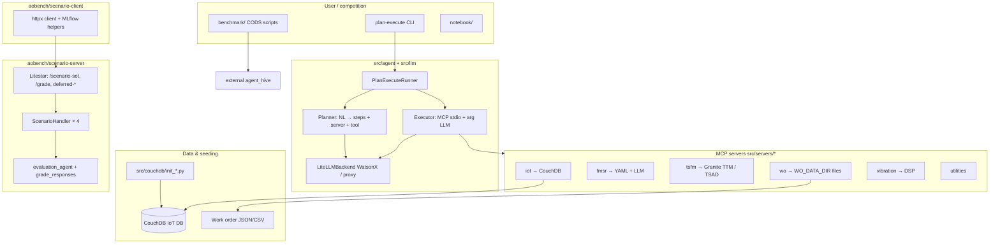

# AssetOpsBench — Repository Overview

This document describes the AssetOpsBench codebase: structure, how components fit together, domain concepts, and architectural choices.

---

## How to use this document

- **Skim** the [Quick jargon](#quick-jargon-terms-you-might-not-know) section first if any acronym looks unfamiliar.
- **Follow the story**: Section 1 = “what is this repo for?”; Section 2 = “where is code?”; Section 3 = “how does each part work?”; later sections = vocabulary and next steps.
- The **diagram** is a map; the paragraphs below it explain *why* the repo is split that way.

---

## Quick jargon

| Term | Plain meaning |
|------|----------------|
| **O&M (operations & maintenance)** | Running factories and buildings day-to-day, and fixing or preventing equipment problems. |
| **Benchmark** | A fixed set of tasks and scoring rules so different AI systems can be compared fairly. |
| **MCP (Model Context Protocol)** | A standard way for an AI assistant to call **tools** (functions) that live in separate programs. Here, each “tool server” is its own process. |
| **stdio** | “Standard input/output”—the server speaks to the agent over the terminal pipe, not over HTTP. |
| **LLM** | Large language model—the component that reads text and writes plans or answers. |
| **Orchestration** | Deciding *which* steps to run *in what order* and wiring their outputs together. |
| **Executor** | The code that actually runs each planned step (here: calls MCP tools, collects results). |
| **Planner** | The code that turns a question into ordered steps (which server, which tool). |
| **Scenario** | One graded task: a prompt, sometimes metadata, and a way to score the submitted answer. |
| **Litestar** | A Python web framework—the **scenario server** uses it for REST-style HTTP endpoints. |
| **Hugging Face (HF)** | A platform that hosts datasets; this project loads scenario text from an IBM dataset there. |
| **MLflow** | An experiment-tracking tool (optional): logs runs so you can compare attempts in competitions or research. |
| **Postgres** | A relational database; can store “grading jobs” that finish in the background. |
| **CouchDB** | A document database used here for IoT-style sensor readings (many small records over time). |
| **Mango query** | CouchDB’s JSON query language (like filtering documents by fields such as `asset_id`). |
| **YAML** | A human-readable config/data file format; FMSR uses it for curated failure-mode lists. |
| **FastMCP** | A helper library to build MCP-compatible tool servers quickly in Python. |
| **DSP (digital signal processing)** | Math on vibration signals (filters, envelopes) to spot mechanical faults. |
| **BMS / chiller** | Building systems—and **chillers** are large cooling machines; sample data follows that style. |
| **PHM (prognostics and health management)** | The field that studies failures, sensors, and remaining useful life—the FMSR server reflects that mindset. |
| **CMMS / EAM** | **Computerized maintenance management** and **enterprise asset management**—software families for assets, work orders, and failure codes. |
| **PM vs CM** | **Preventive** maintenance (scheduled) vs **corrective** (fix after something breaks). |
| **TSFM / TTM** | **Time series foundation model** / **Tiny Time Mixer** (IBM Granite family)—models that predict future sensor values from past values. |
| **TSAD** | Time-series **anomaly detection**—flagging unusual patterns in forecasts or data. |
| **JSONL** | “JSON Lines”: one JSON object per line—a convenient format for big lists of scenarios. |
| **CRUD** | Create, read, update, delete—basic database operations; **eamlite** auto-generates HTTP APIs for tables. |
| **AgentHive** | A separate multi-agent framework used by **CODS** competition scripts—not the same code path as `plan-execute`, but the same dataset story. |
| **LLM-as-judge** | Using a model to score another model’s answer against a rubric (used in scenario grading). |
| **Rubric** | A checklist of qualities (correct steps, no hallucinations, etc.) that must pass for a “correct” mark. |
| **Hallucination** | When a model states facts that are not grounded in data or tools—grading tries to penalize this. |
| **Characteristic form** | A reference “ideal” answer shape stored with each scenario; the judge compares submissions to it. |
| **Trace** | The model’s reasoning or tool-call trail submitted with an answer for grading. |
| **Typed tool catalog** | Each MCP server advertises tools with names and parameter types—so the planner/executor know what can be called. |
| **Silo** | Here: one domain area (IoT, work orders, etc.) with its own server—like separate microservices. |
| **Wheel / packaged product** | The installable Python package defined in `pyproject.toml`—what you `pip`/`uv install`. |
| **`.env`** | A file of configuration secrets and URLs (database addresses, API keys)—loaded at runtime. |

---

## 1. High-level overview

**In one sentence:** AssetOpsBench lets you **run** and **score** AI assistants that maintain industrial equipment, using realistic tool backends (databases, files, models).

**AssetOpsBench** is a **benchmark** and **runtime stack** for **industrial asset operations and maintenance (O&M)** agents. Picture three stacked layers:

1. **Tool layer (MCP servers)** — Small programs expose **skills** as MCP tools (sensor lookups, failure-mode reasoning, forecasting, work-order queries, vibration analysis, utilities). *Why MCP?* So tools are stable, testable, and swappable—like plugins the LLM can invoke.
2. **Orchestration layer** — An LLM **plans** which tools to use and in what order; an **executor** carries out those steps by talking to the MCP processes; a final LLM step **summarizes** results for the user. You drive this from the **`plan-execute`** command-line tool.
3. **Evaluation / competition layer** — A **scenario server** (a normal web API built with **Litestar**) hands out official benchmark questions (from **Hugging Face**), accepts competitor answers, and **grades** them—often with a second LLM acting as a strict grader, plus helper code. It can optionally log runs to **MLflow**, and it can grade **immediately** or **later** (“deferred”), storing results in **Postgres** or in memory.

**Package split:** The installable package **`assetopsbench-mcp`** (see `pyproject.toml`) contains the **agent**, **LLM wrapper**, and **MCP server** programs. The **scenario server** is **not** inside that wheel—it lives under `aobench/scenario-server` and is deployed as its own application.

### Architecture diagram



**How to read the diagram:** Users and competition scripts are on the left. The **plan-execute** path goes through the orchestrator, which calls **MCP servers**; those servers read **CouchDB** or **files**. Competitions can instead use **AgentHive** talking to the **HTTP scenario server**, which downloads tasks and runs **grading**.

### Architectural choices

- **MCP for tools** — Each server is its own process with a clear list of callable tools (a **schema**). The planner only chooses *names* (server + tool); the executor fills in *arguments* after inspecting live schemas. See `DEFAULT_SERVER_PATHS` in `src/agent/plan_execute/executor.py`.
- **Two-phase LLM use in plan-execute** — Phase A: break the question into steps. Phase B: for each tool call, a separate LLM pass turns the step description + prior outputs into concrete JSON arguments (see the module docstring in `src/agent/plan_execute/executor.py`). *Note for readers:* the header comment at the top of `planner.py` that suggests no extra LLM calls during execution is **out of date**.
- **Scenario server decoupled from MCP** — Benchmarking uses simple HTTP: fetch tasks, post results. Heavy grading can run **asynchronously** and survive restarts if **Postgres** is configured (`aobench/scenario-server/src/scenario_server/app.py` startup).
- **Domain split across stores** — **IoT readings** live in **CouchDB** (good for lots of time-stamped documents). **Work orders** default to **files** under `WO_DATA_DIR`. **Failure modes** mix hand-authored **YAML** with **LLM** fallback for uncommon assets (`src/servers/fmsr/main.py`). *Why split?* Each data source matches how that information appears in real plants.

---

## 2. Repository layout

What each top-level folder is **for**:

| Area | Role |
|------|------|
| `src/agent`, `src/llm` | Packaged agent: plan-execute runner, LLM backend |
| `src/servers/*` | Six FastMCP servers (IoT, FMSR, TSFM, WO, vibration, utilities) |
| `src/couchdb` | Scripts to create DBs and load sample IoT / WO-related data |
| `src/scenarios` | Local / Hugging Face scenario helpers |
| `aobench/scenario-server` | HTTP API + handlers + grading |
| `aobench/scenario-client` | Typed HTTP client + MLflow helpers |
| `aobench/datalayer/eamlite` | SQLModel EAM-style schema + generated CRUD API (FastAPI router) |
| `benchmark/` | CODS track runners (Hugging Face dataset + **agent_hive**) |
| `notebook/` | Colab-oriented demo |
| `aaaiwebsite/` | Static/lab site assets (root `main.py` may be a stub, not the site entry) |
| `docs/` | Proposals, plans, overviews |

---

## 3. Deep dive by component


### 3.1 Packaged product: `pyproject.toml`, `src/agent`, `src/llm`

After install, you get one **`plan-execute`** command plus six **`…-mcp-server`** commands—those are the agent and its tool backends.

The wheel exposes scripts: `plan-execute` and six `*-mcp-server` commands. Dependencies center on **MCP**, **litellm**, **CouchDB**, **pandas/numpy/scipy** for servers.

**LLM abstraction** — `src/llm` re-exports `LLMBackend` and `LiteLLMBackend` so the agent can target WatsonX or a LiteLLM proxy with one model-id string (wired in `src/agent/cli.py`). *Translation:* swap provider by changing a string, not rewriting the agent.

**Plan-execute flow** — `PlanExecuteRunner.run`: discover tools → plan → execute → summarize (`src/agent/plan_execute/runner.py`).

**Planning** — `Planner` prompts the model to output rigid blocks (`#Task1`, `#Server1`, `#Tool1`, dependencies `#S1`, etc.) and parses them (`src/agent/plan_execute/planner.py`). This keeps planner output machine-parseable without relying solely on JSON mode. *Why not JSON?* Models sometimes break JSON; line-based templates are easier to repair.

**Execution** — `Executor` lists tools from each MCP process, builds argument prompts from the tool schema, and calls tools over stdio MCP (`src/agent/plan_execute/executor.py`).

**CLI** — `plan-execute` loads `.env`, builds `PlanExecuteRunner`, optional `--json` for full trace (`src/agent/cli.py`) — useful for benchmarks that need `result`, `trace`, etc.

### 3.2 MCP domain servers: `src/servers/*`

Think “six small API apps, each focused on one maintenance topic,” all callable through MCP.

Each server is a **FastMCP** app with `mcp.run(transport="stdio")` (e.g. `src/servers/wo/main.py`).

**IoT (`servers/iot`)** — Connects to CouchDB from env (`COUCHDB_URL`, `IOT_DBNAME`, …), exposes tools for sites, assets, sensors, histories. Helpers use Mango queries over `asset_id` / time windows — **BMS/chiller-style** telemetry. Mirrors how facility engineers query assets and pull observation windows.

**FMSR (`servers/fmsr`)** — **Failure mode ↔ sensor relevancy**: curated lists for known assets, numbered-list parsing, and LLM prompts for open asset types. Reflects **PHM** practice: failure modes and sensor relevance are causal/temporal, not generic text.

**TSFM (`servers/tsfm`)** — **IBM Granite** time-series foundation models: forecasting, finetuning, conformal anomaly detection, with lazy imports so the server can start without full GPU stacks. Env vars standardize paths for models, datasets, outputs (useful for mounted volumes in competitions).

**Work orders (`servers/wo`)** — File-backed CMMS-like tools (orders, PM/CM split, events, failure codes, distributions, simple predictors). Bridges **reactive maintenance data** (tickets) with **IoT state**.

**Vibration (`servers/vibration`)** — DSP (bearing frequencies, envelope, fault detection) — **rotating equipment** condition monitoring.

**Utilities (`servers/utilities`)** — Cross-cutting helpers.

Together, these give the planner a **typed tool catalog** per silo, closer to real enterprise integrations than one monolithic API.

### 3.3 Data seeding: `src/couchdb`

Run the `init_*.py` scripts once to populate databases so the IoT tools return real-looking rows.

`init_asset_data.py` documents env vars and loads JSON sensor exports into CouchDB, creating Mango indexes on `asset_id`, `timestamp` — aligned with IoT MCP query patterns. `init_wo.py` parallels WO seeding where applicable; the MCP WO server defaults to files.

### 3.4 Evaluation stack: `aobench/scenario-server`

This is the “quiz server” for competitions: download questions via HTTP, upload answers, get scores—optional MLflow IDs come back too.

**App composition** — `get_app` registers default handlers (`AOBScenarios`, `AOBIoTScenarios`, `AOBTSFMScenarios`, `AOBWorkOrderScenarios`) unless overridden. Startup selects **Postgres** deferred grading storage or in-memory fallback.

**HTTP surface** — List scenario types, fetch a scenario set (optional MLflow run creation), synchronous grade, deferred grade + status + result (`endpoints.py`). Handler classes are keyed by UUID in `REGISTERED_SCENARIO_HANDLERS`.

**Handler contract** — Abstract base requires `scenario_type`, `fetch_scenarios`, and async `grade_responses` (`handlers/scenario_handler.py`).

**General AOB handler** — Downloads `data/scenarios/all_utterance.jsonl` from `ibm-research/AssetOpsBench`, filters general tasks, grades by unpacking submitter JSON and calling `evaluation_agent` with characteristic answer + trace (`handlers/aob/aob.py`). Sibling handlers mirror this for IoT / TSFM / work-order subsets.

**Grading** — `evaluation_agent` uses an `EvaluationAgent` model and requires *all* rubric booleans true (task completion, data accuracy, result verification, sequence, clarity, no hallucinations) for a pass (`grading/graders.py`) — strict LLM-as-judge style grading for open-ended maintenance answers.

### 3.5 Scenario client: `aobench/scenario-client`

A small Python library so your submission bot doesn’t reimplement HTTP + MLflow details.

`scenario_client/client.py` is an **httpx**-based library with timeouts, SSL options, and **MLflow** `TrackingContext` — the client side of optional tracking from `GET /scenario-set/...?tracking=true`.

### 3.6 EAM data layer: `aobench/datalayer/eamlite`

Optional “classic EAM database + auto HTTP CRUD” layer—not required for the default CouchDB + MCP IoT path.

`eam_models.py` defines SQLModel tables (e.g. `Assetstatus`, `Assettypes`, `Failurecodes`) — an **EAM/CMMS-normalized** relational model. `crud_generator.py` builds FastAPI routers with filter operators (`eq`, `gt`, …). **Supporting infrastructure** for richer EAM-backed scenarios or admin UIs; not the primary path for the default MCP IoT+Couch stack.

### 3.7 Competition runners: `benchmark/`

CODS scripts use **AgentHive**, a different agent framework, but pull the **same public scenarios** from Hugging Face.

`benchmark/cods_track1/run_track_1.py` loads scenarios from Hugging Face and wires **agent_hive** agents (`ReactReflectAgent`, `NewPlanningWorkflow`) with tool modules (`iot_bms_tools`, `fmsr_tools`, etc.). **CODS tracks target AgentHive**, not only `plan-execute`, while sharing the same dataset narrative. Track 2 follows the same pattern in `run_track_2.py`.

### 3.8 Notebooks and site

- `notebook/LLM_Agent.ipynb` — hands-on path for running an agent against the stack.
- `aaaiwebsite/` — materials for the public lab page linked from the README.

---

## 4. Domain concepts Glossary


- **Asset / site / sensor** — Facility hierarchy; IoT tools navigate site → asset → sensor → history.
- **Failure mode & sensor relevancy** — Whether a measurement is **diagnostically informative** for a failure, including temporal behavior (FMSR prompts encode that).
- **TSFM / TTM** — Foundation model for **zero-shot or few-shot forecasting**; TSAD adds anomaly detection on forecasts.
- **Work order (PM vs CM)** — Preventive vs corrective maintenance; agents often correlate alarms → failure codes → WO lifecycle.
- **Characteristic form** — In scenarios, a structured “ideal” answer shape used by the judge alongside submitter `result` and `trace`.

---

## 5. How to extend

- **New tool surface** — Add or modify a FastMCP server under `src/servers`, register a script in `pyproject.toml`, extend `DEFAULT_SERVER_PATHS` in the executor if the logical server name is new.
- **New benchmark slice** — New `ScenarioHandler` + JSONL on Hugging Face; register in `scenario_server/app.py` (or pass custom handlers to `get_app`).
- **Local lab** — Seed CouchDB, set env vars (see `.env.public` / INSTRUCTIONS), run `plan-execute` with `--verbose --show-history`.

---

## 6. Key code references


```29:36:pyproject.toml
[project.scripts]
plan-execute = "agent.cli:main"
iot-mcp-server = "servers.iot.main:main"
utilities-mcp-server = "servers.utilities.main:main"
fmsr-mcp-server = "servers.fmsr.main:main"
tsfm-mcp-server = "servers.tsfm.main:main"
wo-mcp-server = "servers.wo.main:main"
vibration-mcp-server = "servers.vibration.main:main"
```

```26:33:src/agent/plan_execute/executor.py
DEFAULT_SERVER_PATHS: dict[str, Path | str] = {
    "iot": "iot-mcp-server",
    "utilities": "utilities-mcp-server",
    "fmsr": "fmsr-mcp-server",
    "tsfm": "tsfm-mcp-server",
    "wo": "wo-mcp-server",
    "vibration": "vibration-mcp-server",
}
```

```70:97:src/agent/plan_execute/runner.py
    async def run(self, question: str) -> OrchestratorResult:
        """Run the full plan-execute loop for a question.
        ...
        """
        # 1. Discover
        _log.info("Discovering server capabilities...")
        server_descriptions = await self._executor.get_server_descriptions()

        # 2. Plan
        _log.info("Planning...")
        plan = self._planner.generate_plan(question, server_descriptions)
        _log.info("Plan has %d step(s).", len(plan.steps))

        # 3. Execute
        history = await self._executor.execute_plan(plan, question)

        # 4. Summarise
        _log.info("Summarising...")
        results_text = "\n\n".join(
```

```111:119:aobench/scenario-server/src/scenario_server/app.py
    if include_default_handlers:
        register_scenario_handlers(
            handlers=[
                AOBScenarios,
                AOBIoTScenarios,
                AOBTSFMScenarios,
                AOBWorkOrderScenarios,
            ]
        )
```

```222:274:aobench/scenario-server/src/scenario_server/endpoints.py
@get("/scenario-set/{scenario_set_id: str}")
async def fetch_scenario(scenario_set_id: str, tracking: bool = False) -> dict:
    ...


@post("/scenario-set/{scenario_set_id: str}/grade")
async def grade_submission(
    scenario_set_id: str, data: Submission
) -> list[ScenarioGrade]:
    ...
```

---