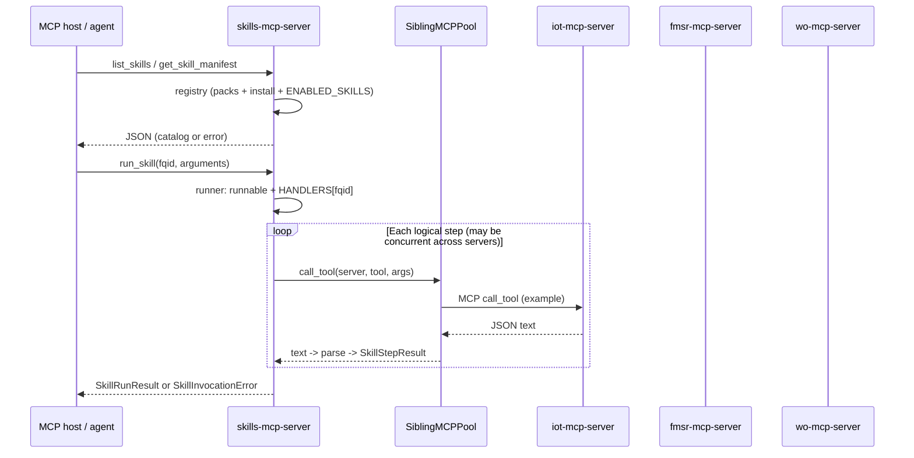

# Skills MCP server — documentation

This document describes the skills Model Context Protocol server under [`src/servers/skills/`](../src/servers/skills/): how to **run and configure** it, **environment variables**, **plan-execute integration**, **troubleshooting**, **repository layout**, **implementation** (modules, design choices), and **sample agent prompts** with expected outcomes.

The skills server implements a **pack-based marketplace**: agents discover skills by **fully qualified id (FQID)** `pack_id/skill_id`, **install state** on disk and optional **`ENABLED_SKILLS`** determine **runnability**, and execution **calls sibling MCP servers** (`iot`, `fmsr`, `wo`, …) over stdio. That keeps **`required_servers`** in each skill manifest accurate for deployment.

---

## Prerequisites

- Repo root as working directory.
- Dependencies installed: `uv sync` (see [`INSTRUCTIONS.md`](../INSTRUCTIONS.md)).
- For live skill runs (not unit tests), configure CouchDB, work-order data, and FMSR the same way as for the standalone `iot`, `fmsr`, and `wo` servers. Those processes are started **as separate MCP subprocesses** when a skill needs them.

Python must resolve the `servers` package. The project’s pytest config sets `pythonpath = ["src"]`. Prefer **`uv run` from the repo root** so the environment and **`cwd`** match what sibling spawns expect (see [`src/agent/plan_execute/executor.py`](../src/agent/plan_execute/executor.py) and [`src/servers/common/mcp_stdio.py`](../src/servers/common/mcp_stdio.py)).

---

## Skill identity and packs

- Each **pack** is a **directory** whose root contains `manifest.yaml` or `manifest.yml`.
- The manifest **must** declare a **`pack_id`** (no `/` character). Each skill has an **`id`** unique within that pack.
- **FQID** = `pack_id` + `/` + skill `id`, e.g. `assetopsbench/pump_seal_inspection`.
- **Bundled packs** live under [`src/servers/skills/packs/`](../src/servers/skills/packs/). **Additional** pack roots or container directories are listed in `SKILL_PACK_DIRS` (comma-separated). Merging two catalogs that produce the same FQID is a **hard error** at load time.

Example install state (see also [`src/servers/skills/examples/install_state.example.json`](../src/servers/skills/examples/install_state.example.json)):

```json
{
  "installed": [
    "assetopsbench/pump_seal_inspection",
    "assetopsbench_demo/safety_clearance_check"
  ]
}
```

---

## Entry point

The console script is registered in [`pyproject.toml`](../pyproject.toml):

```text
skills-mcp-server → servers.skills.main:main
```

Run on **stdio**:

```bash
cd /path/to/AssetOpsBench
uv run skills-mcp-server
```

**Logging:** Optional `LOG_LEVEL=INFO` or `DEBUG`.

---

## Environment variables

| Variable | Purpose |
|----------|---------|
| `SKILL_INSTALL_STATE_PATH` | JSON file listing installed FQIDs under key `installed`. If unset, defaults to `~/.assetopsbench/skill_install_state.json`. **Missing file ⇒ no installs** unless bootstrap runs (see below). |
| `SKILL_BOOTSTRAP_INSTALL` | If truthy (`1`, `true`, `yes`, `on`) and the install state file **does not exist yet**, the first **`skills-mcp-server` startup** (via `main()`) creates it with **every FQID** from the merged catalog. Does **not** overwrite an existing file. Off by default when unset; [`.env.public`](../.env.public) sets `1` for local/plan-execute convenience. |
| `SKILL_PACK_DIRS` | Comma-separated extra pack **roots**: either a pack directory (with manifest at that root) or a directory whose **subdirectories** are packs. Loaded **after** bundled packs; duplicate FQID → startup / catalog error. |
| `SKILL_SIBLING_COMMANDS` | Optional override: comma-separated `server=command` entries, e.g. `iot=iot-mcp-server,fmsr=fmsr-mcp-server,wo=wo-mcp-server`. Defaults match executor entry-point names. |
| `SKILL_MCP_CALL_TIMEOUT_SEC` | Per sibling `call_tool` timeout in seconds (default `120`). |
| `ENABLED_SKILLS` | If **non-empty**, comma-separated entries: full **FQID** `pack/skill` or **bare** `skill_id` when unique in the catalog (e.g. `pump_seal_inspection` → `assetopsbench/pump_seal_inspection`). Runnable only if installed, `default_enabled`, **and** the skill’s FQID is in the allowlist after expansion. If **empty or unset**, no env allowlist (only install file + `default_enabled`). Unknown or ambiguous bare ids are ignored with a log warning. |
| `LOG_LEVEL` | Logging verbosity for the skills process. |

Forwarded **child env** for sibling processes (CouchDB, WO paths, etc.) is aligned with plan-execute via [`src/servers/common/mcp_stdio.py`](../src/servers/common/mcp_stdio.py); extend **`MCP_ENV_EXACT`** there when adding new variables that sibling MCP servers need.

---

## Tools (summary)

| Tool | Role |
|------|------|
| `list_skills` | Returns `{ "skills": [ ... ], "catalog_error": null \| string }`. Each row includes `fqid`, `pack_id`, `skill_id`, manifest fields, **`installed`**, and **`runnable`**. |
| `get_skill_manifest` | Argument: `skill_id` (**FQID**). Full metadata plus `installed` / `runnable`. Unknown FQID → `{ "error": "..." }`. |
| `run_skill` | Arguments: `skill_id` (FQID), `arguments` (object). Validates args per handler; runs steps via **sibling MCP**; returns structured `steps` and `overall_ok`. |

### Bundled example skills

| FQID | Description |
|------|-------------|
| `assetopsbench/pump_seal_inspection` | IoT `sensors`, FMSR `get_failure_modes`, WO `get_work_orders` (three siblings; see §4.7 for parallel execution). |
| `assetopsbench_demo/asset_diagnostics_bundle` | IoT sensors + failure modes + `get_failure_mode_sensor_mapping`. |
| `assetopsbench_demo/safety_clearance_check` | IoT sensors + WO history + deterministic clearance gate. |

---

## Plan-execute integration

[`src/agent/plan_execute/executor.py`](../src/agent/plan_execute/executor.py) includes `"skills": "skills-mcp-server"` in `DEFAULT_SERVER_PATHS`. Environment variables listed in `MCP_ENV_EXACT` (including `SKILL_*`) are forwarded to MCP subprocesses so nested `uv run` siblings see the same configuration when relevant.

---

## Goals (what the code is optimizing for)

The skills server supports an **industrial skill marketplace** prototype:

- **Discovery:** Agents list skills and read metadata (dependencies, asset types, keywords) without executing anything.
- **Governance:** **Install state** (persistent JSON), optional **`SKILL_BOOTSTRAP_INSTALL`**, and optional **`ENABLED_SKILLS`** allowlist determine whether a skill is **runnable**, separate from “exists in catalog.”
- **Namespacing:** Skills are identified by **FQID** `pack_id/skill_id` so different packs cannot collide silently.
- **Composition:** Skills run **multi-step operational logic** by calling **sibling MCP servers** over stdio, not by importing their Python modules in production paths. That keeps **`required_servers` in the manifest** honest: those processes must exist for real runs.

---

## Repository layout

All paths below are relative to the repo root.

```text
src/servers/skills/
├── main.py                 # FastMCP entry, tools, startup validation, stdio run
├── registry.py             # Pack merge, FQIDs, install state, bootstrap, list/get manifest
├── runner.py               # run_skill_impl: checks + HANDLERS dispatch
├── sibling_mcp.py          # Stdio MCP client pool (lazy sessions, timeouts)
├── results.py              # SkillRunResult, SkillStepResult, SkillInvocationError
├── packs/                  # Bundled pack directories
│   ├── assetopsbench/manifest.yaml
│   └── assetopsbench_demo/manifest.yaml
├── examples/
│   └── install_state.example.json
├── handlers/
│   ├── __init__.py         # HANDLERS map: fqid -> async callable
│   ├── _aliases.py         # Shared Pydantic Field descriptions for common arguments
│   ├── _util.py            # mcp_step, JSON parse, detail_ok
│   ├── pump.py
│   ├── diagnostics.py
│   └── safety.py
└── tests/
    ├── conftest.py         # Install state + FakeSiblingMCPPool reset
    ├── fake_sibling.py     # In-memory pool for unit tests
    ├── test_registry.py
    ├── test_runner.py
    ├── test_sibling_mcp.py # Sibling pool / MCP-adjacent behavior
    └── test_tools.py       # FastMCP call_tool contract tests

src/servers/common/
└── mcp_stdio.py            # Shared stdio spawn + env forwarding (executor + skills)
```

The **plan-execute** client invokes the same console entry point as other servers; see [`src/agent/plan_execute/planner.py`](../src/agent/plan_execute/planner.py) for orchestration hints.

---

## End-to-end flow



Handlers may issue **multiple** `call_tool` operations **in parallel** when steps do not depend on each other (e.g. `assetopsbench/pump_seal_inspection` uses `asyncio.gather` so three sibling calls share wall time instead of stacking timeouts).

---

## Implementation reference

### `main.py` — FastMCP surface and process startup

**Role:** Defines `FastMCP("skills")` and registers tools. Applies `load_dotenv()` at import so env-based config matches other servers.

**Tools:**

| Tool | Sync/async | Purpose |
|------|------------|---------|
| `list_skills` | sync | Returns `ListSkillsResult` (`skills`, optional `catalog_error`). |
| `get_skill_manifest` | sync | Returns `SkillManifestView` or `MarketplaceError`. |
| `run_skill` | **async** | Delegates to `run_skill_impl`; needs async because handlers await sibling MCP I/O. |

**Startup (`main()` only — not on import):**

1. **`_startup_validate_catalog()`** — Calls `load_skill_catalog()` and **`sys.exit(1)`** on `MarketplaceLoadError`. Importing `servers.skills.main` does **not** exit; only the **`main()`** entry path validates the catalog so tests can import the module without failing the process.
2. **`maybe_bootstrap_install_state()`** — If `SKILL_BOOTSTRAP_INSTALL` is truthy and the install-state file is missing, writes all catalog FQIDs to that path (see §Environment variables).

**Stdio shutdown:** Some MCP clients close stdin immediately after the last tool result. That can raise nested `ExceptionGroup`s containing `anyio.ClosedResourceError`. `main()` treats “only client disconnect” as **benign** and exits quietly so successful tool runs are not reported as crashes.

**Design choice: soft vs hard errors**

- Duplicate FQID / bad YAML during merge → **`MarketplaceLoadError`** (startup exit from `main()`, or caught in `list_skills` → `catalog_error`).
- Unknown FQID on `get_skill_manifest` → **`MarketplaceError`** payload (not a process exit).
- Bad args / not runnable / missing handler → **`SkillInvocationError`** from `run_skill`.

---

### `registry.py` — marketplace data model and merge rules

**Role:** Load pack manifests from disk, assign **FQIDs**, merge optional extra pack roots, read/write **install state**, compute **`installed`** and **`runnable`**.

**FQID construction:** `fqid = f"{pack_id}/{skill_id}"` with separator constant `FQID_SEP = "/"`. Both `pack_id` and per-skill `id` must not contain `/`, enforced at load time.

**Merge order:**

1. **Bundled packs:** subdirectories of [`src/servers/skills/packs/`](../src/servers/skills/packs/) that contain `manifest.yaml` or `manifest.yml`.
2. **Extra packs:** `SKILL_PACK_DIRS` — comma-separated paths. Each path may be either a **pack directory** (manifest at root), or a **container directory** whose **child** directories are packs.

**Design choice: duplicate FQID is fatal**  
If two pack sources produce the same `fqid`, `merge_pack_records()` raises `MarketplaceLoadError` with both paths. There is no “later overrides earlier” rule.

**Install state:**  
JSON file `{ "installed": [ "<fqid>", ... ] }`. Path from **`SKILL_INSTALL_STATE_PATH`** (see environment table). Missing or invalid file → **no installs** (`read_installed_fqids()` → empty set).  
`write_installed_fqids` writes via a **temp file + replace** for atomicity.

**`SKILL_BOOTSTRAP_INSTALL`:** Implemented by **`maybe_bootstrap_install_state()`** (called from `main()`). Creates the install file with **every** merged FQID if the file is absent; never overwrites an existing file. Keeps import-based tests from writing to the operator home unless they call `main()` or bootstrap explicitly.

**Runnable predicate (`_runnable`):**  
`True` only if:

- `default_enabled` is true **and**
- FQID is in the install set **and**
- either **`ENABLED_SKILLS`** is unset/empty **or** the FQID appears in the parsed allowlist.

**`ENABLED_SKILLS` resolution:** `parse_enabled_skills_allowlist()` splits on commas and expands each token with **`coerce_skill_fqid()`**: tokens that already contain `/` are used as-is; **bare** `skill_id` strings match when **exactly one** catalog row has that `skill_id`. Unknown or ambiguous tokens are skipped with a warning.

**Cache:** `load_skill_catalog()` memoizes the merged catalog; tests can call **`clear_skill_catalog_cache()`** when merge inputs change.

**Why Pydantic models here:** Manifest rows and API responses are schema-stable JSON; validation catches typos in pack YAML early and keeps tool outputs consistent for hosts.

---

### `sibling_mcp.py` — sibling MCP as first-class composition

**Role:** Implement **`SiblingMCPPool`**: for each logical server name (`iot`, `fmsr`, `wo`, …), open **one** stdio MCP session, reuse it for the lifetime of the skills process, and serialize **per-server** calls with an `asyncio.Lock` (avoids overlapping `call_tool` on the same session). Independent servers can be busy **at the same time**; only calls **to the same server** are serialized.

**Spawn rules:** Uses [`servers.common.mcp_stdio.make_stdio_params`](../src/servers/common/mcp_stdio.py) with `repo_root` from `registry.repo_root()` so child processes match **plan-execute**: typically `uv run <console-script>` from the repo root with forwarded env and `PYTHONPATH` including `src`.

**Timeouts:** `asyncio.wait_for` around `session.call_tool` with `SKILL_MCP_CALL_TIMEOUT_SEC` (default 120). Slow FMSR paths can require tuning.

**Configuration:**

- Default command map matches [`pyproject.toml`](../pyproject.toml) scripts (`iot-mcp-server`, etc.).
- Override with **`SKILL_SIBLING_COMMANDS`**: `server=command` pairs separated by commas.

**Test hook:** `set_sibling_pool_for_testing` replaces the process-global pool so tests never spawn real subprocesses unless desired.

**Design choice: MCP siblings vs in-process imports**  
Calling sibling MCP servers costs extra process and IPC overhead but keeps **`required_servers`** honest, avoids hidden coupling to internal modules, and mirrors how the benchmark executor talks to tools.

---

### `servers/common/mcp_stdio.py` — shared stdio contract

**Role:** Single place for **which env vars** are forwarded into MCP children and how **`StdioServerParameters`** are built.

**Design choice: shared module**  
The plan-execute [`executor`](../src/agent/plan_execute/executor.py) and the skills **sibling pool** both spawn MCP subprocesses. Duplicating env allowlists would cause subtle “works in executor, fails in skills” bugs.  
`MCP_ENV_EXACT` includes skill-related keys (`SKILL_*`) so nested children receive the same configuration when appropriate.

---

### `runner.py` — dispatch and policy gate

**Role:** `run_skill_impl(skill_id, arguments)`:

1. Resolves manifest via `get_manifest_for_fqid`.
2. If not runnable → `SkillInvocationError` with a fixed explanation (install / `default_enabled` / `ENABLED_SKILLS`).
3. Looks up **`HANDLERS[skill_id]`** in [`handlers/__init__.py`](../src/servers/skills/handlers/__init__.py). A catalog entry without a handler yields **marketplace/catalog mismatch** — intentional: YAML alone cannot execute; every shipped skill needs a registered Python entry in v1.
4. Awaits the handler with `get_sibling_pool()`.
5. Catches **`ValidationError`** from Pydantic argument models and returns `SkillInvocationError`.

**Design choice: explicit handler registry (v1)**  
A declarative YAML workflow interpreter was **out of scope for v1**. Handlers remain Python for clarity, testability, and tight typing.

---

### `results.py` — uniform execution envelope

**Types:**

- **`SkillStepResult`:** `name`, `ok`, `detail` (dict — typically parsed sibling JSON).
- **`SkillRunResult`:** `skill_id`, `overall_ok` (conjunction of step `ok`), `steps`.
- **`SkillInvocationError`:** `error` string before or instead of a normal run.

**Design choice:**  
`overall_ok` is explicit rather than inferring failure from arbitrary JSON keys inside `detail`. Per-step `ok` uses `detail_ok()` in handlers.

---

### `handlers/` — per-skill logic

**`handlers/_aliases.py`:** Shared Pydantic `Field` factories (e.g. `site_name_field`, `asset_id_field`) for consistent descriptions across argument models.

**Shared utilities (`_util.py`):**

- **`parse_mcp_json`:** Sibling tools return **text**; skills assume JSON. Malformed output becomes a dict with `error` so the step fails cleanly.
- **`detail_ok`:** Treats a present non-empty `error` field as failure (matches `ErrorResult`-style payloads from other servers).
- **`mcp_step`:** One await of `pool.call_tool`, then build `SkillStepResult`. Catches timeouts and generic exceptions at the MCP boundary.

**Bundled handlers and FQIDs** (must match pack manifests and `HANDLERS`):

| FQID | File | Sibling tools used (high level) |
|------|------|----------------------------------|
| `assetopsbench/pump_seal_inspection` | `pump.py` | `iot.sensors`, `fmsr.get_failure_modes`, `wo.get_work_orders` — invoked **in parallel** (`asyncio.gather`) because each targets a **different** sibling server; returned `steps` order is still `iot_sensors`, `fmsr_failure_modes`, `wo_get_work_orders`. |
| `assetopsbench_demo/asset_diagnostics_bundle` | `diagnostics.py` | `sensors`, `get_failure_modes`, `get_failure_mode_sensor_mapping` (caps list sizes) |
| `assetopsbench_demo/safety_clearance_check` | `safety.py` | `sensors`, `get_work_orders`, plus local **`clearance_decision`** step |

**Design choice: argument models per skill**  
Each handler validates with a small Pydantic model (`PumpSealArgs`, …) so `run_skill` receives a generic `dict` from MCP but execution stays type-safe inside Python.

**Design choice: demo safety skill**  
The clearance step encodes simple, deterministic rules (sensor count, WO count) suitable for benchmarks and tests without a separate safety MCP server.

---

### Tests — structure and doubles

**`conftest.py`:**

- Sets **`SKILL_INSTALL_STATE_PATH`** to a temp file listing all three bundled FQIDs so most tests see **`runnable: true`** unless overridden.
- Resets **`set_sibling_pool_for_testing(None)`** after each test so real pools are not accidentally shared.

**`fake_sibling.py`:**  
`FakeSiblingMCPPool` maps `(server_name, tool_name)` → dict; `call_tool` returns `json.dumps(...)`. Records calls for assertions.

**`test_tools.py`:** Invokes **`mcp.call_tool`** on the in-process `FastMCP` instance (no stdio), validating JSON shapes returned to hosts.

**`test_runner.py`:** Calls `run_skill_impl` directly with env overrides and fake pool for fast failures (validation, not runnable, full diagnostics/safety paths).

**`test_registry.py`:** Covers merge, install flags, `ENABLED_SKILLS`, duplicate FQID error, bootstrap behavior.

**`test_sibling_mcp.py`:** Covers sibling MCP pool behavior (see source for scope).

**Run tests from repo root:**

```bash
uv run pytest src/servers/skills/tests/ -v
```

Optional integration tests can spawn real `iot-mcp-server` / `fmsr-mcp-server` / `wo-mcp-server` behind a pytest marker when the environment is configured.

---

## Key files (quick map)

| Path | Role |
|------|------|
| [`src/servers/skills/packs/`](../src/servers/skills/packs/) | Bundled pack directories (`manifest.yaml` per pack). |
| [`src/servers/skills/registry.py`](../src/servers/skills/registry.py) | Merge packs, FQIDs, install state, discovery flags, bootstrap. |
| [`src/servers/skills/sibling_mcp.py`](../src/servers/skills/sibling_mcp.py) | Lazy, reused stdio MCP sessions to sibling servers. |
| [`src/servers/skills/handlers/`](../src/servers/skills/handlers/) | Per-FQID Python handlers (v1; no YAML interpreter). |
| [`src/servers/common/mcp_stdio.py`](../src/servers/common/mcp_stdio.py) | Shared stdio spawn rules for executor and skills server. |

---

## Troubleshooting

- **Nothing is runnable:** Create or update `SKILL_INSTALL_STATE_PATH` so `installed` contains the FQIDs you need, or set **`SKILL_BOOTSTRAP_INSTALL`** once so the first startup seeds the file (see environment table).
- **`catalog_error` in `list_skills`:** Fix pack YAML or resolve duplicate FQIDs across merged catalogs.
- **Sibling / `uv run` failures:** Run from the **repo root**; ensure entry-point names in `SKILL_SIBLING_COMMANDS` match [`pyproject.toml`](../pyproject.toml) scripts.
- **Timeouts:** Raise `SKILL_MCP_CALL_TIMEOUT_SEC` for slow FMSR LLM paths.

---

## Sample test prompts and expected outcomes

**Preconditions:**

- **Install state:** `SKILL_INSTALL_STATE_PATH` should list the FQIDs you intend to run (see example JSON above), unless you rely on **`SKILL_BOOTSTRAP_INSTALL`** for a first-time file.
- **`ENABLED_SKILLS`:** Leave **empty** for the simplest path. If set, use comma-separated **FQIDs** or **unique bare** `skill_id` tokens; a skill is runnable only if installed **and** allowlisted when this env is non-empty.
- **Live data:** For `overall_ok: true` on real stacks, configure CouchDB, WO data, and FMSR like the standalone servers. Without that, you may still see **structured** per-step failures (`ok: false`, `detail.error`), which still validates wiring.

### Marketplace discovery

**Prompt:**  
“List all skills in the marketplace and tell me which are installed and runnable.”

**Expected tool use:**  
`list_skills` (no arguments).

**Expected output:**

- `catalog_error` is null or absent if packs merged cleanly; if set, the catalog failed to load (e.g. duplicate FQID).
- Each row includes **`fqid`**, **`installed`**, **`runnable`**, **`required_servers`**, **`description`**, and related manifest fields.
- At least these FQIDs appear: `assetopsbench/pump_seal_inspection`, `assetopsbench_demo/asset_diagnostics_bundle`, `assetopsbench_demo/safety_clearance_check`.

### Single-skill metadata

**Prompt:**  
“What is required to run the pump seal inspection skill? Which MCP servers does it need, and can I run it right now?”

**Expected tool use:**  
`get_skill_manifest` with `skill_id: "assetopsbench/pump_seal_inspection"`.

**Expected output:**

- `required_servers` includes `iot`, `fmsr`, `wo`.
- `installed` and `runnable` reflect your install file and `ENABLED_SKILLS`.
- If you pass a bogus FQID (e.g. `vendor/nope`), the tool returns an object with **`error`** describing an unknown fq-id, not a full manifest.

### Execute pump seal inspection

**Prompt:**  
“Run the pump seal inspection skill for site MAIN, asset PUMP1, asset name centrifugal pump.”

**Expected tool use:**  
`run_skill` with:

```json
{
  "skill_id": "assetopsbench/pump_seal_inspection",
  "arguments": {
    "site_name": "MAIN",
    "asset_id": "PUMP1",
    "asset_name": "centrifugal pump"
  }
}
```

**Expected output:**

- Top-level **`skill_id`** matches the FQID.
- **`steps`** has length **3**, in order: `iot_sensors`, `fmsr_failure_modes`, `wo_get_work_orders` (the three sibling calls may run **concurrently**; order in the payload is fixed).
- Each step has **`ok`** and **`detail`** (parsed sibling tool JSON).
- **`overall_ok`** is true only if every step has `ok: true` (depends on live IoT / FMSR / WO data).

### Diagnostics / root-cause style bundle

**Prompt:**  
“Run the asset diagnostics bundle for site MAIN, asset PUMP1, asset name centrifugal pump, and summarize failure modes versus sensors.”

**Expected tool use:**  
`run_skill` with `skill_id: "assetopsbench_demo/asset_diagnostics_bundle"` and the same three string arguments as in the pump example (`site_name`, `asset_id`, `asset_name`).

**Expected output:**

- **Three** steps: `iot_sensors`, `fmsr_failure_modes`, `fmsr_failure_mode_sensor_mapping`.
- The third step’s **`detail`** reflects the FMSR mapping response when that call succeeds.
- The assistant’s natural-language summary should tie together sensors, failure modes, and mapping results from those steps.

### Safety clearance demo

**Prompt:**  
“Run the safety clearance check for site MAIN and asset PUMP1.”

**Expected tool use:**  
`run_skill` with:

```json
{
  "skill_id": "assetopsbench_demo/safety_clearance_check",
  "arguments": {
    "site_name": "MAIN",
    "asset_id": "PUMP1"
  }
}
```

**Expected output:**

- Steps include `iot_sensors`, `wo_get_work_orders`, and **`clearance_decision`**.
- `clearance_decision.detail` includes a **`passed`** flag consistent with the handler rules (sensors and work-order history gate).
- **`overall_ok`** may be false if IoT/WO fails or the gate fails—use that as a **negative** test case with bad or empty data.

### Install and policy gates

**Prompt A (not installed):**  
“Run the pump seal inspection skill for MAIN, PUMP1, centrifugal pump.”

**Setup (before `skills-mcp-server`):**

1. Open the JSON file from **`SKILL_INSTALL_STATE_PATH`**, or the default **`~/.assetopsbench/skill_install_state.json`** if unset.
2. Remove **`assetopsbench/pump_seal_inspection`** from the `installed` array.
3. Leave **`ENABLED_SKILLS`** empty or unset so the failure is **not** masked by the allowlist (Prompt B covers that case).
4. Restart the skills server from the **repo root** (e.g. `uv run skills-mcp-server`), then issue the prompt above (via your MCP client or `run_skill` with the pump FQID and the usual arguments).

**Expected output:**  
`run_skill` returns **`error`** only (no `steps` list). The text explains why the skill cannot run (not installed, turned off in the pack, or blocked by `ENABLED_SKILLS`).

**Prompt B (`ENABLED_SKILLS` allowlist):**

You are testing **only** the allowlist. Both skills must still be in the install file so the pump skill shows **`installed: true`**. Put **one** skill id in `ENABLED_SKILLS` (e.g. safety only), not the pump.

**Setup (before `skills-mcp-server`):**

1. In the JSON file used by `SKILL_INSTALL_STATE_PATH`, list both:
   - `assetopsbench/pump_seal_inspection`
   - `assetopsbench_demo/safety_clearance_check`
2. Allow only safety, for example:
   ```bash
   export ENABLED_SKILLS=assetopsbench_demo/safety_clearance_check
   ```
3. Start the server from the **repo root** (e.g. `uv run skills-mcp-server`).

**Prompt:**  
“Run the pump seal inspection skill for site MAIN, asset PUMP1, asset name centrifugal pump.” (You can also call `get_skill_manifest` for `assetopsbench/pump_seal_inspection` first, then `run_skill`.)

**Tools to call:**

- `get_skill_manifest` with `skill_id: "assetopsbench/pump_seal_inspection"`.
- `run_skill` with the same id and `site_name`, `asset_id`, `asset_name`.

**What you should see:**

- **`get_skill_manifest`:** A normal manifest (not “unknown skill”). For the pump: **`installed: true`**, **`runnable: false`**. For `assetopsbench_demo/safety_clearance_check` with the same env: **`runnable: true`**.
- **`run_skill` (pump):** Only **`error`** (no `steps`). The message should name **`ENABLED_SKILLS`** and tell you to add the id or unset the var—not the “not installed” message from Prompt A.
- **Tests:** [`test_enabled_skills_allowlist_filters_runnable`](../src/servers/skills/tests/test_registry.py) checks **`installed`** / **`runnable`**. To assert the **`run_skill`** message, copy the idea of [`test_not_runnable_when_uninstalled`](../src/servers/skills/tests/test_runner.py) but keep both skills installed and set `ENABLED_SKILLS`; see [`src/servers/skills/runner.py`](../src/servers/skills/runner.py).

**After Prompt B:** Run `unset ENABLED_SKILLS` in the same shell (or drop the line from `.env` / `.env.public` if you put it there). If you pointed `SKILL_INSTALL_STATE_PATH` at a temp file, run `unset SKILL_INSTALL_STATE_PATH`. Restore your usual install JSON if you edited it in place.

### Planner-level prompt (orchestration)

**Prompt:**  
“Plan and execute: inspect mechanical seal health for centrifugal pump PUMP1 at site MAIN using the **skills** server instead of calling iot, fmsr, and wo in separate steps.”

**Expected behavior:**

- With the skills server in the server map, the plan should prefer **one** step on server **`skills`** with tool **`run_skill`**, FQID **`assetopsbench/pump_seal_inspection`**, and arguments **`site_name`**, **`asset_id`**, **`asset_name`** (see [`src/agent/plan_execute/planner.py`](../src/agent/plan_execute/planner.py)).
- The final answer should be grounded in the **`run_skill`** result (`steps`, sensors, failure modes, work orders).

**Why this matters:** Same user task with vs. without the skills server is the right comparison for **tool-call count**, **latency**, and **planner complexity** (HPML-style benchmarking).

### Extended sample prompts (discovery, policy, composition, new packs)

These prompts stress **semantic discovery**, **governance**, **single-call composition** vs. many raw tools, and **on-the-fly pack** realism. They complement **Marketplace discovery** through **Planner-level prompt** above; reuse the **Install and policy gates** setups when a scenario needs a skill uninstalled or blocked by `ENABLED_SKILLS`.

#### Marketplace and semantic discovery

**Prompt 1 — keyword / asset-class discovery:**  
“Using the skills server only, what **runnable** skills apply to a **centrifugal pump** seal or mechanical inspection? List FQIDs, required MCP servers, and whether each is installed.”

**Expected tool use:** `list_skills` (host filters rows by `asset_types`, `keywords`, `description`, and `runnable`).

**Expected output:** Rows for pump-relevant bundled skills (e.g. `assetopsbench/pump_seal_inspection`) include accurate `required_servers`, `installed`, and `runnable`; narrative ties keywords to the chosen FQIDs.

**Prompt 2 — filter before execute:**  
“Find skills that need **iot**, **fmsr**, and **wo** together; pick the one best match for pump seal context; then fetch its full manifest.”

**Expected tool use:** `list_skills`, then `get_skill_manifest` on the selected FQID.

**Expected output:** Correct tri-server skill identified; manifest matches listing (`required_servers`, runnable flags).

**Prompt 3 — unknown FQID:**  
“Run skill `acme/industrial_rca` for site MAIN.”

**Expected tool use:** `get_skill_manifest` and/or `run_skill`.

**Expected output:** `MarketplaceError`-style payload (`error` describes unknown fq-id) or `SkillInvocationError`; **not** a partial `SkillRunResult` with steps.

#### Policy and install (natural-language variants)

**Prompt 4 — install gap (NL):**  
“Run pump seal inspection for MAIN / PUMP1 / centrifugal pump.”

**Setup:** Same as **Prompt A (not installed)** under **Install and policy gates** (remove `assetopsbench/pump_seal_inspection` from `installed`).

**Expected output:** `run_skill` returns **`error`** only; message indicates not installed (or equivalent gate), not sibling step failures.

**Prompt 5 — allowlist (NL):**  
“List all skills and mark which I’m allowed to run; then try one that is catalogued but blocked.”

**Setup:** Same as **Prompt B (`ENABLED_SKILLS` allowlist)** under **Install and policy gates** (both skills installed; allowlist excludes the skill you attempt to run).

**Expected output:** `list_skills` shows `runnable: true` only for allowlisted FQIDs; blocked `run_skill` returns `SkillInvocationError` naming `ENABLED_SKILLS`.

#### Execution and composition (benchmark-style)

**Prompt 6 — one skills call vs. many siblings:**  
“Assess seal-related risk for **PUMP1** at **MAIN** using **one** skills-server invocation if possible—don’t call iot, fmsr, and wo separately.”

**Expected tool use:** Single `run_skill` with `assetopsbench/pump_seal_inspection` and the usual arguments (`site_name`, `asset_id`, `asset_name`).

**Expected output:** Answer grounded in one `SkillRunResult` (`steps`, per-step `detail`); no separate planner steps to sibling servers for the same facts unless the host lacks the skills server.

**Prompt 7 — RCA-shaped summary:**  
“Give a structured comparison of **failure modes vs. sensor mapping** for **PUMP1** at **MAIN**.”

**Expected tool use:** `run_skill` with `skill_id: "assetopsbench_demo/asset_diagnostics_bundle"` (same three string arguments as the pump seal example).

**Expected output:** Natural-language summary ties together all three steps (`iot_sensors`, `fmsr_failure_modes`, `fmsr_failure_mode_sensor_mapping`).

**Prompt 8 — safety before recommendation:**  
“Before any maintenance recommendation, run the **safety clearance** workflow for MAIN / PUMP1 and say clearly if clearance **passed**.”

**Expected tool use:** `run_skill` with `assetopsbench_demo/safety_clearance_check` (`site_name`, `asset_id`).

**Expected output:** Explicit **passed/failed** from `clearance_decision.detail.passed`; if IoT/WO steps fail, `overall_ok` may be false and the assistant should not treat that as clearance granted.

#### New industrial asset class / vendor pack (regression for roadmap)

**Prompt 9 — manifest-only pack:**  
“A new pack `vendor_wind/turbine_blade_inspection` appears on disk under **`SKILL_PACK_DIRS`** with **manifest-only** metadata (no registered Python handler). What shows up in `list_skills`? Can you run it?”

**Expected output (v1 behavior):** After catalog reload / server restart, `list_skills` may show the row if the pack merges cleanly. `run_skill` returns **`SkillInvocationError`** with **no handler registered** (marketplace/catalog mismatch)—YAML alone does not execute until a declarative runner or handler exists (see **runner.py** note in this doc).

**Prompt 10 — teach-the-agent:**  
“I’m operating a **new asset class** (e.g. wind turbine gearbox). What skills exist today that could still apply, what metadata would a **new** skill need in the manifest (`required_servers`, `asset_types`), and what must be true in install state before running?”

**Expected tool use:** `list_skills` (and optionally `get_skill_manifest` on candidates).

**Expected output:** Correct use of `asset_types` / `keywords` / `required_servers`; accurate statement that **install** + **runnable** flags and a **handler** (v1) are required for execution; no claim that adding YAML alone is sufficient.

---

**Automated regression:** CI uses pytest, `FakeSiblingMCPPool`, and in-process `FastMCP.call_tool`; see **Tests** above and [`src/servers/skills/tests/`](../src/servers/skills/tests/).
