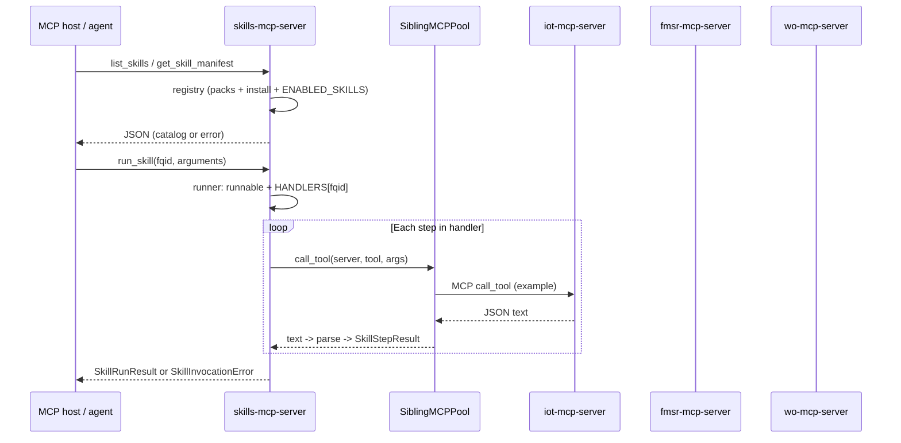

# Skills MCP server — code reference

This document describes the **implementation** of the skills Model Context Protocol server: layout, responsibilities of each module, design rationale, and **sample test scenarios** with expected outcomes.

---

## 1. Goals (what the code is optimizing for)

The skills server supports an **industrial skill marketplace** prototype:

- **Discovery:** Agents list skills and read metadata (dependencies, asset types, keywords) without executing anything.
- **Governance:** **Install state** (persistent JSON) and optional **`ENABLED_SKILLS`** env allowlist determine whether a skill is **runnable**, separate from “exists in catalog.”
- **Namespacing:** Skills are identified by a **fully qualified id (FQID)** `pack_id/skill_id` so different packs cannot collide silently.
- **Composition:** Skills run **multi-step operational logic** by calling **sibling MCP servers** (`iot`, `fmsr`, `wo`, …) over stdio, not by importing their Python modules in production paths. That keeps **`required_servers` in the manifest** honest: those processes must exist for real runs.

---

## 2. Repository layout

All paths below are relative to the repo root.

```text
src/servers/skills/
├── main.py                 # FastMCP entry, tools, startup catalog validation
├── registry.py             # Pack merge, FQIDs, install state, list/get manifest
├── runner.py               # run_skill_impl: checks + HANDLERS dispatch
├── sibling_mcp.py          # Stdio MCP client pool (lazy sessions, timeouts)
├── results.py              # SkillRunResult, SkillStepResult, SkillInvocationError
├── packs/                  # Bundled pack directories
│   ├── assetopsbench/manifest.yaml
│   └── assetopsbench_demo/manifest.yaml
├── examples/
│   └── install_state.example.json
├── handlers/
│   ├── __init__.py         # HANDLERS map: fqid -> async callable
│   ├── _util.py            # mcp_step, JSON parse, detail_ok
│   ├── pump.py
│   ├── diagnostics.py
│   └── safety.py
└── tests/
    ├── conftest.py         # Install state + FakeSiblingMCPPool reset
    ├── fake_sibling.py     # In-memory pool for unit tests
    ├── test_registry.py
    ├── test_runner.py
    └── test_tools.py       # FastMCP call_tool contract tests

src/servers/common/
└── mcp_stdio.py            # Shared stdio spawn + env forwarding (executor + skills)
```

The **plan-execute** client invokes the same console entry point as other servers; see [`src/agent/plan_execute/executor.py`](../src/agent/plan_execute/executor.py) and [`src/agent/plan_execute/planner.py`](../src/agent/plan_execute/planner.py) for orchestration hints.

---

## 3. End-to-end flow



---

## 4. Component deep dives

### 4.1 `main.py` — FastMCP surface and startup validation

**Role:** Defines the MCP server `FastMCP("skills")` and registers tools. Applies `load_dotenv()` so env-based config matches other servers.

**Tools:**

| Tool | Sync/async | Purpose |
|------|------------|---------|
| `list_skills` | sync | Returns `ListSkillsResult` (`skills`, optional `catalog_error`). |
| `get_skill_manifest` | sync | Returns `SkillManifestView` or `MarketplaceError`. |
| `run_skill` | **async** | Delegates to `run_skill_impl`; needs async because handlers await sibling MCP I/O. |

**Design choice: fail fast on import**  
`_startup_validate_catalog()` runs when `main` is imported: it calls `load_skill_catalog()` and **`sys.exit(1)`** on `MarketplaceLoadError`. That turns **broken pack merges** (e.g. duplicate FQID) into an obvious process failure instead of a silent empty catalog.

**Design choice: soft vs hard errors**  
- Duplicate FQID / bad YAML during merge → **`MarketplaceLoadError`** (startup exit, or caught in `list_skills` → `catalog_error`).  
- Unknown FQID on `get_skill_manifest` → **`MarketplaceError`** payload (not a process exit).  
- Bad args / not runnable / missing handler → **`SkillInvocationError`** from `run_skill`.

---

### 4.2 `registry.py` — marketplace data model and merge rules

**Role:** Load pack manifests from disk, assign **FQIDs**, merge optional extra pack roots, read/write **install state**, compute **`installed`** and **`runnable`**.

**FQID construction:** `fqid = f"{pack_id}/{skill_id}"` with separator constant `FQID_SEP = "/"`. Both `pack_id` and per-skill `id` must not contain `/`, enforced at load time.

**Merge order:**

1. **Bundled packs:** subdirectories of [`src/servers/skills/packs/`](../src/servers/skills/packs/) that contain `manifest.yaml` or `manifest.yml`.  
2. **Extra packs:** `SKILL_PACK_DIRS` — comma-separated paths. Each path may be either:
   - a **pack directory** (manifest at root), or  
   - a **container directory** whose **child** directories are packs.

**Design choice: duplicate FQID is fatal**  
If two pack sources produce the same `fqid`, `merge_pack_records()` raises `MarketplaceLoadError` with both paths. There is no “later overrides earlier” rule: ambiguity is rejected so agents and operators do not depend on undocumented precedence.

**Install state:**  
JSON file `{ "installed": [ "<fqid>", ... ] }`. Path from **`SKILL_INSTALL_STATE_PATH`**, defaulting under the user home directory (see code). Missing or invalid file → **no installs** (`read_installed_fqids()` → empty set).  
`write_installed_fqids` writes via a **temp file + replace** for atomicity.

**Runnable predicate (`_runnable`):**  
`True` only if:

- `default_enabled` is true **and**
- FQID is in the install set **and**
- either **`ENABLED_SKILLS`** env is unset/empty **or** the FQID appears in that comma-separated list of **FQIDs**.

This matches the intended semantics: empty `ENABLED_SKILLS` means “no extra env allowlist”; non-empty means “intersection with install + default_enabled.”

**Why Pydantic models here:** Manifest rows and API responses are schema-stable JSON; validation catches typos in pack YAML early and keeps tool outputs consistent for hosts.

---

### 4.3 `sibling_mcp.py` — sibling MCP as first-class composition

**Role:** Implement **`SiblingMCPPool`**: for each logical server name (`iot`, `fmsr`, `wo`, …), open **one** stdio MCP session, reuse it for the lifetime of the skills process, and serialize **per-server** calls with an `asyncio.Lock` (avoids overlapping `call_tool` on the same session).

**Spawn rules:** Uses [`servers.common.mcp_stdio.make_stdio_params`](../src/servers/common/mcp_stdio.py) with `repo_root` from `registry.repo_root()` so child processes match **plan-execute**: typically `uv run <console-script>` from the repo root with forwarded env and `PYTHONPATH` including `src`.

**Timeouts:** `asyncio.wait_for` around `session.call_tool` with `SKILL_MCP_CALL_TIMEOUT_SEC` (default 120). Slow FMSR paths can require tuning.

**Configuration:**  
- Default command map matches [`pyproject.toml`] scripts (`iot-mcp-server`, etc.).  
- Override with **`SKILL_SIBLING_COMMANDS`**: `server=command` pairs separated by commas.

**Test hook:** `set_sibling_pool_for_testing` replaces the process-global pool so tests never spawn real subprocesses unless desired.

**Design choice: MCP siblings vs in-process imports**  
Calling sibling MCP servers costs extra process and IPC overhead but:

- Keeps **one skill server** aligned with **declared `required_servers`**.  
- Avoids hidden coupling to `servers.iot` / `servers.fmsr` modules (easier to reason about deployment boundaries).  
- Mirrors how the benchmark executor already talks to tools.

---

### 4.4 `servers/common/mcp_stdio.py` — shared stdio contract

**Role:** Single place for **which env vars** are forwarded into MCP children and how **`StdioServerParameters`** are built.

**Design choice: shared module**  
The plan-execute [`executor`](../src/agent/plan_execute/executor.py) and the skills **sibling pool** both spawn MCP subprocesses. Duplicating env allowlists would cause subtle “works in executor, fails in skills” bugs.  
`MCP_ENV_EXACT` includes skill-related keys (`SKILL_*`) so nested children receive the same configuration when appropriate.

---

### 4.5 `runner.py` — dispatch and policy gate

**Role:** `run_skill_impl(skill_id, arguments)`:

1. Resolves manifest via `get_manifest_for_fqid`.  
2. If not runnable → `SkillInvocationError` with a fixed explanation (install / `default_enabled` / `ENABLED_SKILLS`).  
3. Looks up **`HANDLERS[skill_id]`** in [`handlers/__init__.py`](../src/servers/skills/handlers/__init__.py). A catalog entry without a handler yields **marketplace/catalog mismatch** — intentional: YAML alone cannot execute; every shipped skill needs a registered Python entry in v1.  
4. Awaits the handler with `get_sibling_pool()`.  
5. Catches **`ValidationError`** from Pydantic argument models and returns `SkillInvocationError`.

**Design choice: explicit handler registry (v1)**  
A declarative YAML workflow interpreter was **out of scope for v1**. Handlers remain Python for clarity, testability, and tight typing. Future work could generate steps from YAML but would still sit behind the same `HANDLERS` or a plugin loader.

---

### 4.6 `results.py` — uniform execution envelope

**Types:**

- **`SkillStepResult`:** `name`, `ok`, `detail` (dict — typically parsed sibling JSON).  
- **`SkillRunResult`:** `skill_id`, `overall_ok` (conjunction of step `ok`), `steps`.  
- **`SkillInvocationError`:** `error` string before or instead of a normal run.

**Design choice:**  
`overall_ok` is explicit rather than inferring failure from arbitrary JSON keys inside `detail`. Per-step `ok` uses `detail_ok()` in handlers (see below).

---

### 4.7 `handlers/` — per-skill logic

**Shared utilities (`_util.py`):**

- **`parse_mcp_json`:** Sibling tools return **text**; skills assume JSON. Malformed output becomes a dict with `error` so the step fails cleanly.  
- **`detail_ok`:** Treats a present non-empty `error` field as failure (matches `ErrorResult`-style payloads from other servers).  
- **`mcp_step`:** One await of `pool.call_tool`, then build `SkillStepResult`. Catches timeouts and generic exceptions at the MCP boundary.

**Bundled handlers and FQIDs** (must match pack manifests and `HANDLERS`):

| FQID | File | Sibling tools used (high level) |
|------|------|----------------------------------|
| `assetopsbench/pump_seal_inspection` | `pump.py` | `iot.sensors`, `fmsr.get_failure_modes`, `wo.get_work_orders` |
| `assetopsbench_demo/asset_diagnostics_bundle` | `diagnostics.py` | `sensors`, `get_failure_modes`, `get_failure_mode_sensor_mapping` (caps list sizes) |
| `assetopsbench_demo/safety_clearance_check` | `safety.py` | `sensors`, `get_work_orders`, plus local **`clearance_decision`** step |

**Design choice: argument models per skill**  
Each handler validates with a small Pydantic model (`PumpSealArgs`, …) so `run_skill` receives a generic `dict` from MCP but execution stays type-safe inside Python.

**Design choice: demo safety skill**  
The clearance step encodes simple, deterministic rules (sensor count, WO count) suitable for benchmarks and tests without a separate safety MCP server.

---

### 4.8 Tests — structure and doubles

**`conftest.py`:**  
- Sets **`SKILL_INSTALL_STATE_PATH`** to a temp file listing all three bundled FQIDs so most tests see **`runnable: true`** unless overridden.  
- Resets **`set_sibling_pool_for_testing(None)`** after each test so real pools are not accidentally shared.

**`fake_sibling.py`:**  
`FakeSiblingMCPPool` maps `(server_name, tool_name)` → dict; `call_tool` returns `json.dumps(...)`. Records calls for assertions.

**`test_tools.py`:** Invokes **`mcp.call_tool`** on the in-process `FastMCP` instance (no stdio), validating JSON shapes returned to hosts.

**`test_runner.py`:** Calls `run_skill_impl` directly with env overrides and fake pool for fast failures (validation, not runnable, full diagnostics/safety paths).

**`test_registry.py`:** Covers merge, install flags, `ENABLED_SKILLS`, duplicate FQID error.

---

## 5. Sample test prompts and expected outcomes


**Preconditions:**

- **Install state:** `SKILL_INSTALL_STATE_PATH` should list the FQIDs you intend to run (see [`src/servers/skills/examples/install_state.example.json`](../src/servers/skills/examples/install_state.example.json)).
- **`ENABLED_SKILLS`:** Leave **empty** for the simplest path (only install file + `default_enabled` gate runnability). If set, use comma-separated **FQIDs**; a skill is runnable only if it is installed **and** listed when this env is non-empty.
- **Live data:** For `overall_ok: true` on real stacks, configure CouchDB, WO data, and FMSR like the standalone servers. Without that, you may still see **structured** per-step failures (`ok: false`, `detail.error`), which still validates wiring.


---

### 5.1 Marketplace discovery

**Prompt:**  
“List all skills in the marketplace and tell me which are installed and runnable.”

**Expected tool use:**  
`list_skills` (no arguments).

**Expected output:**

- `catalog_error` is null or absent if packs merged cleanly; if set, the catalog failed to load (e.g. duplicate FQID).
- Each row includes **`fqid`**, **`installed`**, **`runnable`**, **`required_servers`**, **`description`**, and related manifest fields.
- At least these FQIDs appear: `assetopsbench/pump_seal_inspection`, `assetopsbench_demo/asset_diagnostics_bundle`, `assetopsbench_demo/safety_clearance_check`.

---

### 5.2 Single-skill metadata

**Prompt:**  
“What is required to run the pump seal inspection skill? Which MCP servers does it need, and can I run it right now?”

**Expected tool use:**  
`get_skill_manifest` with `skill_id: "assetopsbench/pump_seal_inspection"`.

**Expected output:**

- `required_servers` includes `iot`, `fmsr`, `wo`.
- `installed` and `runnable` reflect your install file and `ENABLED_SKILLS`.
- If you pass a bogus FQID (e.g. `vendor/nope`), the tool returns an object with **`error`** describing an unknown fq-id, not a full manifest.

---

### 5.3 Execute pump seal inspection

**Prompt:**  
“Run the pump seal inspection skill for site MAIN, asset PUMP1, asset name centrifugal pump.”

**Expected tool use:**  
`run_skill` with:

```json
{
  "skill_id": "assetopsbench/pump_seal_inspection",
  "arguments": {
    "site_name": "MAIN",
    "asset_id": "PUMP1",
    "asset_name": "centrifugal pump"
  }
}
```

**Expected output:**

- Top-level **`skill_id`** matches the FQID.
- **`steps`** has length **3**, in order: `iot_sensors`, `fmsr_failure_modes`, `wo_get_work_orders`.
- Each step has **`ok`** and **`detail`** (parsed sibling tool JSON).
- **`overall_ok`** is true only if every step has `ok: true` (depends on live IoT / FMSR / WO data).

---

### 5.4 Diagnostics / root-cause style bundle

**Prompt:**  
“Run the asset diagnostics bundle for site MAIN, asset PUMP1, asset name centrifugal pump, and summarize failure modes versus sensors.”

**Expected tool use:**  
`run_skill` with `skill_id: "assetopsbench_demo/asset_diagnostics_bundle"` and the same three string arguments as in §5.3 (`site_name`, `asset_id`, `asset_name`).

**Expected output:**

- **Three** steps: `iot_sensors`, `fmsr_failure_modes`, `fmsr_failure_mode_sensor_mapping`.
- The third step’s **`detail`** reflects the FMSR mapping response when that call succeeds.
- The assistant’s natural-language summary should tie together sensors, failure modes, and mapping results from those steps.

---

### 5.5 Safety clearance demo

**Prompt:**  
“Run the safety clearance check for site MAIN and asset PUMP1.”

**Expected tool use:**  
`run_skill` with:

```json
{
  "skill_id": "assetopsbench_demo/safety_clearance_check",
  "arguments": {
    "site_name": "MAIN",
    "asset_id": "PUMP1"
  }
}
```

**Expected output:**

- Steps include `iot_sensors`, `wo_get_work_orders`, and **`clearance_decision`**.
- `clearance_decision.detail` includes a **`passed`** flag consistent with the handler rules (sensors and work-order history gate).
- **`overall_ok`** may be false if IoT/WO fails or the gate fails—use that as a **negative** test case with bad or empty data.

---

### 5.6 Install and policy gates

**Prompt A (not installed):**  
Remove `assetopsbench/pump_seal_inspection` from the `installed` list in your install-state file, then ask: “Run the pump seal inspection skill for MAIN, PUMP1, centrifugal pump.”

**Expected output:**  
`run_skill` returns an **error** payload (not a partial step list): skill is **not runnable** (install / `default_enabled` / `ENABLED_SKILLS messaging).

**Prompt B (`ENABLED_SKILLS` allowlist):**  
Set `ENABLED_SKILLS` to a **different** FQID than the one you invoke (e.g. only `assetopsbench_demo/safety_clearance_check`), then request the pump skill.

**Expected output:**  
`get_skill_manifest` shows **`runnable: false`** for excluded skills; `run_skill` on an excluded FQID returns the same **not runnable** style error.

---

### 5.7 Planner-level prompt (orchestration)

**Prompt:**  
“Plan and execute: inspect mechanical seal health for centrifugal pump PUMP1 at site MAIN using the **skills** server instead of calling iot, fmsr, and wo in separate steps.”

**Expected behavior:**

- With the skills server in the server map, the plan should prefer **one** step on server **`skills`** with tool **`run_skill`**, FQID **`assetopsbench/pump_seal_inspection`**, and arguments **`site_name`**, **`asset_id`**, **`asset_name`** (see [`src/agent/plan_execute/planner.py`](../src/agent/plan_execute/planner.py)).
- The final answer should be grounded in the **`run_skill`** result (`steps`, sensors, failure modes, work orders).

**Why this matters:** Same user task with vs. without the skills server is the right comparison for **tool-call count**, **latency**, and **planner complexity** (HPML-style benchmarking).

---

**Automated regression:** For CI, the repository uses pytest, `FakeSiblingMCPPool`, and in-process `FastMCP.call_tool`; see **§4.8** in this document and [`src/servers/skills/tests/`](../src/servers/skills/tests/).

---

## 6. Extending the skills server

1. **Add a pack directory** with `manifest.yaml` (`pack_id`, `skills` list).  
2. **Implement a handler** in `handlers/`, register it in `HANDLERS` with the exact **FQID** string.  
3. **Add tests** using `FakeSiblingMCPPool` for CI; add optional integration tests that spawn real siblings.  
4. **Document** new env needs in [`Skills_MCP_Server_Guide.md`](Skills_MCP_Server_Guide.md) and extend `MCP_ENV_EXACT` in `mcp_stdio.py` if sibling servers need new forwarded variables.
